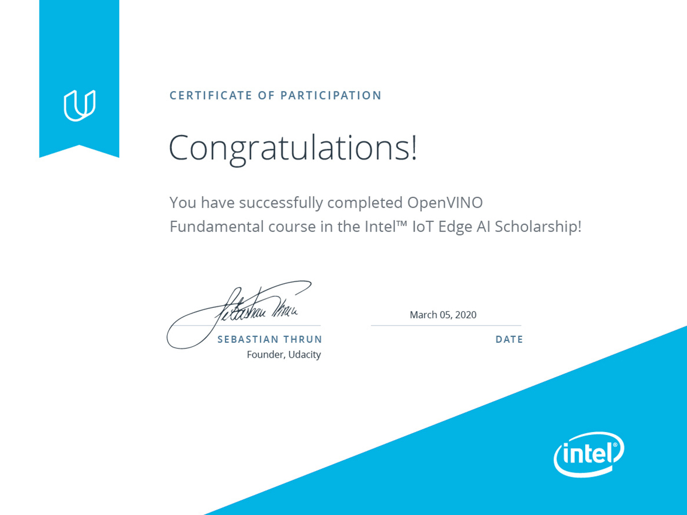

# Bertelsmann Cloud Challenge

## 60 Days Udacity

### Daily Updates

- [Day01](#day1) [Day02](#day2) [Day03](#day3) [Day04](#day4) [Day05](#day5) [Day06](#day6) [Day07](#day7) [Day08](#day8) [Day09](#day9) [Day10](#day10) 
- [Day11](#day11) [Day12](#day12) [Day13](#day13) [Day14](#day14) [Day15](#day15) [Day16](#day16) [Day17](#day17) [Day18](#day18) [Day19](#day19) [Day20](#day20)
- [Day21](#day21) [Day22](#day22) [Day23](#day23) [Day24](#day24) [Day25](#day25) [Day26](#day26) [Day27](#day27) [Day28](#day28) [Day29](#day29) [Day30](#day30)
- [Day31](#day31) [Day32](#day32) [Day33](#day33) [Day34](#day34) [Day35](#day35) [Day36](#day36) [Day37](#day37) [Day38](#day38) [Day39](#day39) [Day40](#day40)
- [Day41](#day41)[Day42](#day42) [Day43](#day43) [Day44](#day44) [Day45](#day45) [Day46](#day46) [Day47](#day47) [Day48](#day48) [Day49](#day49) [Day50](#day50)
- [Day51](#day51)[Day52](#day52) [Day53](#day53) [Day54](#day54) [Day55](#day55) [Day56](#day56) [Day57](#day57) [Day58](#day58) [Day59](#day59) [Day60](#day0)
***
### Day01

[Back to Top](#top)

*** 
### Day02

[Github link](https://github.com/ahmedhasandrlnd/dog_breed_classifier_capstone)

[Back to Top](#top)

***
### Day03

[Back to Top](#top)

***
### Day04

[Back to Top](#top)

***
### Day05

[Back to Top](#top)

***
### Day06

[Back to Top](#top)

***
### Day07

[Back to Top](#top)

***
### Day08

[Back to Top](#top)

***
### Day09

[Airtable link](https://airtable.com/shradzeT431S2P1LC/tbl37bRXN1z6X25IZ/viw4cse1F0hi5r4p5?blocks=hide)

[Back to Top](#top)

***
### Day10

[Back to Top](#top)

***
### Day11

[Back to Top](#top)

*** 
### Day12

[Back to Top](#top)

***
### Day13

[Back to Top](#top)

***
### Day14

[Back to Top](#top)

***
### Day15

[Back to Top](#top)

***
### Day16

[Youtube link](https://www.youtube.com/watch?v=-hFAWk6hyZA)

[Back to Top](#top)

***
### Day17

[Back to Top](#top)

***
### Day18

[Back to Top](#top)

***
### Day19

[Blog link](https://medium.com/@hasan.ahmedmonjurul/getting-started-with-git-in-bertelsmann-tech-scholarship-b5d4b349ac6)

[Back to Top](#top)

***
### Day20

[Back to Top](#top)

***
### Day21

[Back to Top](#top)

*** 
### Day22

[Back to Top](#top)

***
### Day23

[Back to Top](#top)

***
### Day24

[Back to Top](#top)

***
### Day25

[Certificate](images/day25b.pdf)

[Back to Top](#top)

***
### Day26

[Back to Top](#top)

***
### Day27

[Back to Top](#top)

***
### Day28

[Back to Top](#top)

***
### Day29

[Back to Top](#top)

***
### Day30

[Back to Top](#top)

***
### Day31

[Back to Top](#top)

*** 
### Day32

[Back to Top](#top)

***
### Day33

[Back to Top](#top)

***
### Day34

[Back to Top](#top)

***
### Day35

[Youtube link for the webinar](
https://www.youtube.com/watch?v=3lbfWdjN3yk) 
[Here is the Presentation Slide for the webinar](
https://docs.google.com/presentation/d/1nY1Y--bwrak7mtXkantUM6kh47TjqU5xwjP_55imzJM/edit?usp=sharing)
[BMC Template for Team Work for the webinar](
https://docs.google.com/document/d/1o9FrSoxo2cD8TTEND9N3MhIW4ZWbfNsVb6msIggW3uY/edit?usp=sharing)

[Back to Top](#top)

***
### Day36

[Back to Top](#top)

***
### Day37

[Back to Top](#top)

***
### Day38

[AMA Transcript](images/day38b.pdf)

[Back to Top](#top)

***
### Day39

[Back to Top](#top)

***
### Day40

[Back to Top](#top)

***
### Day41

[Certificate](images/day41b.pdf)

[Back to Top](#top)

***
### Day42

[Back to Top](#top)

***
### Day43

[Back to Top](#top)

***
### Day44

[Back to Top](#top)

***
### Day45

[Back to Top](#top)

***
### Day46

[Back to Top](#top)

***
### Day47

[Back to Top](#top)

***
### Day48

[Back to Top](#top)

***
### Day49

[Back to Top](#top)

***
### Day50

[Back to Top](#top)

***
### Day51

[Back to Top](#top)

***
### Day52

[Back to Top](#top)

***
### Day53

[Back to Top](#top)

***
### Day54

[Back to Top](#top)

***
### Day55

[Back to Top](#top)

***
### Day56

[Back to Top](#top)

***
### Day57

[Back to Top](#top)

***
### Day58

[Back to Top](#top)

***
### Day59

[Day59](images/day59b.pdf)

[Back to Top](#top)

***
### Day60

[Day60](images/day60b.pdf)

[Back to Top](#top)

***