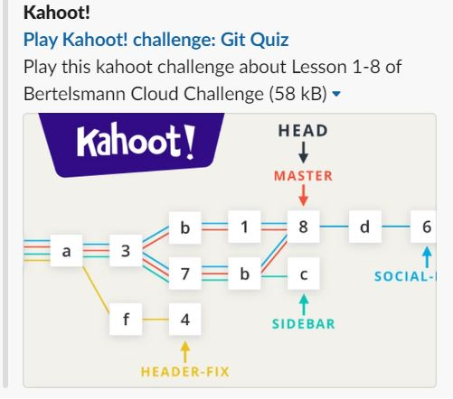

# Bertelsmann Cloud Challenge

## 60 Days Udacity

### Daily Updates

- [Day01](#day1) [Day02](#day2) [Day03](#day3) [Day04](#day4) [Day05](#day5) [Day06](#day6) [Day07](#day7) [Day08](#day8) [Day09](#day9) [Day10](#day10) 
- [Day11](#day11) [Day12](#day12) [Day13](#day13) [Day14](#day14) [Day15](#day15) [Day16](#day16) [Day17](#day17) [Day18](#day18) [Day19](#day19) [Day20](#day20)

***
### Day01

[Back to Top](#top)

*** 
### Day02

[Github link](https://github.com/ahmedhasandrlnd/dog_breed_classifier_capstone)

[Back to Top](#top)

***
### Day03

[Back to Top](#top)

***
### Day04

[Back to Top](#top)

***
### Day05

[Back to Top](#top)

***
### Day06

[Back to Top](#top)

***
### Day07

[Back to Top](#top)

***
### Day08

[Back to Top](#top)

***
### Day09

[Airtable link](https://airtable.com/shradzeT431S2P1LC/tbl37bRXN1z6X25IZ/viw4cse1F0hi5r4p5?blocks=hide)

[Back to Top](#top)

***
### Day10

[Back to Top](#top)

***
### Day11

[Back to Top](#top)

*** 
### Day12

[Back to Top](#top)

***
### Day13

[Back to Top](#top)

***
### Day14

[Back to Top](#top)

***
### Day15

[Back to Top](#top)

***
### Day16

[Youtube link](https://www.youtube.com/watch?v=-hFAWk6hyZA)

[Back to Top](#top)

***
### Day17

[Back to Top](#top)

***
### Day18

[Back to Top](#top)

***
### Day19

[Blog link](https://medium.com/@hasan.ahmedmonjurul/getting-started-with-git-in-bertelsmann-tech-scholarship-b5d4b349ac6)

[Back to Top](#top)

***
### Day20

[Back to Top](#top)

***

